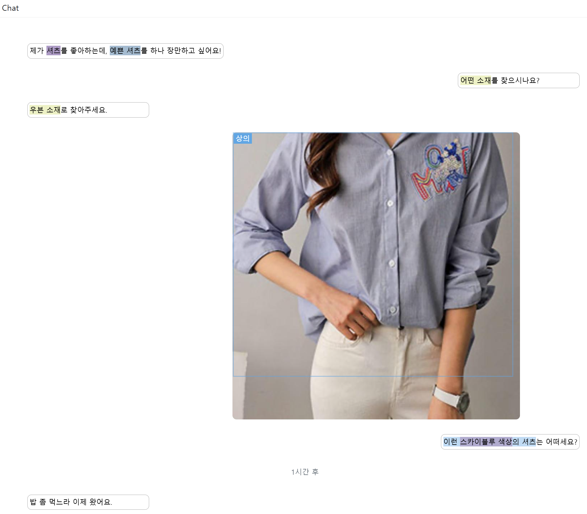

# 멀티 모달 대화 모델을 위한 패션 지식 대화 데이터 셋 <br>:복합대화 연구용 데이터셋 V.2 (데이터)

# 목적 및 소개
- <b> 목적 </b>: 텍스트로 이루어진 대화 뿐만 아니라 이미지까지 포함된 대화도 언어모델이 처리할 수 있도록하는 것이 목적.
- <b> 도메인 </b>: 이미지와 텍스트 모두에 대한 이해가 있어야 대화가 가능한 패션으로 도메인을 설정. 
- <b> 대화 내용 </b>: 패션 주제를 정해 놓고 이에대해 system과 user가 서로 대화를 나누는 내용으로 구성. <br>주로 user가 패션에 대한 지식이나 이미지를 요청하고 system이 그에대한 답변으로 관련 지식이나 이미지를 찾아주는 형태를 가짐.



# 특징
- <b> 의도 및 감정 라벨링 </b>: user 및 system의 발화와 함께 발화가 가지는 의도 (intent), 감정 (sentiment)을 함께 라벨링함.
- <b> 패션 속성 리스트 라벨링 </b>: user가 어떤 종류의 패션 이미지를 원하는지 패션 속성 리스트 (state)를 라벨링함. 대화 도중 요구하는 패션 이미지가 달라지면 state 또한 초기화 됨.
- <b> 모달 간 상호참조 정보 라벨링 </b>: 대화 내 모달 간 상호참조 정보 (coreference)를 라벨링하여 모델이 텍스트가 어느 이미지의 어떤 부분을 가리키는지 학습할 수 있도록 함.
- <b> 한글로 구축 된 데이터 셋 </b>

# 메타데이터
- <b>도메인</b>: 패션 이미지 및 대화
- <b>데이터 유형</b>: 텍스트 (이미지 URL 및 속성 태그 포함)
- <b>데이터 형식</b>: JSON
- <b>데이터 출처</b>: AI Hub의 패션 이미지 데이터셋을 기반으로 구축 [[링크]](https://www.aihub.or.kr/aihubdata/data/view.do?currMenu=&topMenu=&aihubDataSe=data&dataSetSn=51)
- <b>라벨링 유형</b>: 다음을 포함하는 발화 배열 형식의 대화
    - 의도 (intent)
    - 감정 (sentiment)
    - 이미지
    - 요구 패션 속성 리스트 (state)
    - 대화 내 참조 정보 (coreference)
- <b>라벨링 형식</b>: JSON


# 데이터 통계량
| 통계량 | 수치 |
|-------|-------:|
| 대화 (전체) | 15,293 |
| 대화 (state 정보 포함)| 12,687 |
| 대화 (coreference 정보 포함)| 12,670 |
| 세션 (대화가 지속적으로 이어진 시간적 기간) | 30,792 |
| 대화 평균 발화 수 | 35 |
| 대화에 등장한 패션 이미지 | 40,461 |
| 대화에 포함된 unique 패션 이미지 | 29,829 |
| 대화에 포함된 query된 패션 속성 |  58,156 |
| 대화에 포함된 query된 unique 패션 속성 |  2,634|
| 대화에 포함된 평균 coreference | 19  |

#  데이터 구조
## 예시
```python
[
    {   
        'meta': 
        {
            'topic': '24_02_001_플레어 디테일이 있는 미디 기장의 그린 스커트 추천',
            'chat_desc': '24_02_001_플레어 디테일이 있는 미디 기장의 그린 스커트 추천'
        },
        'dialog':
        [
            {
                'speaker': 'user',
                'msg_type': 'text',
                'msg':
                {
                    'eid': 'utter-utter-utter-1',
                    'text': '안녕.',
                    'annotation':
                    {
                        'intent': 'CHAT', 
                        'sentiment': 'neutral'
                    }
                    'last_modified': '2024-1-12 18:2',
                    'type':'text'
                },
                'msg_id': 'utter-utter-utter-1'
            },
            {
                'speaker': 'system',
                'msg_type': 'text',
                'msg': 
                {
                    'eid': 'utter-utter-utter-4',
                    'text': '어서오세요. 무엇을 도와드릴까요?',
                    'info': {},
                    'annotation':
                    {
                        'strategy':'PRE-SUGGESTION'
                    },
                    'last_modified': '2024-1-12 18:2',
                    'type': 'text'
                },
                'msg_id': 'utter-utter-utter-4'
            },
            {
                'speaker': 'system',
                'msg_type': 'image',
                'msg': {
                    'eid': 'utter-utter-utter-img-24',
                    'images':
                    [{'bbox_info': {'원피스': {'bbox_xywh': [220, 29, 395, 751],
                    'bbox_xywh_norm':[0.275, 0.027645376549094377, 0.49375, 0.7159199237368923],
                    'image_wh': [800, 1049]}},
                    'f_name': '1075643',
                    'query_tags': ['원피스:카테고리:드레스', '원피스:색상:블랙', '원피스:기장:발목'],
                    'src': 'https://storage.googleapis.com/k_fashion_images/k_fashion_images/1075643.jpg',
                    'tags': ['스타일:서브스타일:소피스트케이티드',
                            '스타일:스타일:페미닌',
                            '원피스:기장:발목',
                            '원피스:넥라인:브이넥',
                            '원피스:디테일:셔링',
                            '원피스:색상:블랙',
                            '원피스:소매기장:긴팔',
                            '원피스:소재:우븐',
                            '원피스:옷깃:셔츠칼라',
                            '원피스:카테고리:드레스',
                            '원피스:핏:노멀']
                    }],
                    'last_modified': '2024-1-12 18:2',
                    'type': 'image'
                },
                'msg_id': 'utter-utter-utter-img-24'
            },
            ...
        ]
        "state_label":
        [
            ...,
            {
                'added_query_state': ['원피스:카테고리:드레스'],
                'cr_query_state': [],
                'cr_target': '',
                'prev_query_state': ['기타:목적:문학의 밤 행사'],
                'query_state': ['원피스:카테고리:드레스', '기타:목적:문학의 밤 행사'],
                'summary': ''
            },
            {
                'request_state': ['원피스:색상:']
            },
            {
                'added_query_state': ['원피스:색상:블랙'],
                'cr_query_state': [],
                'cr_target': '',
                'prev_query_state': ['원피스:카테고리:드레스', '기타:목적:문학의 밤 행사'],
                'query_state': ['원피스:색상:블랙', '원피스:카테고리:드레스', '기타:목적:문학의 밤 행사'],
                'summary': ''
            },
            ...
        ],
        "cr_label":
        [
            'entities':
            [
                {
                    'id': 'E-0',
                    'mentions':
                    [
                        {
                            'target': 'T',
                            'id': 'TB-2-34',
                            'start': 14,
                            'end': 46,
                            'peer-id': 'T-2-34'
                        },
                        ...
                    ]
                },
                ...
            ],
            "relations":
            [
                {'head': 'E-0', 'tail': 'E-1', 'relation': 'up_down'},
                ...
            ]
        ]

    },
    ...
]
```
## JSON 구조 설명

- `meta`  
  - `topic`: 대화의 주제, 예시에서는 특정 아이템 추천을 주제로 사용
  - `chat_desc`: 채팅 내용 설명. topic과 같을 수 있음

- `dialog` (대화 내역을 담는 리스트):
  - `speaker`: 메시지의 발화자, `user` 또는 `system`, `session_seperator`
  - `msg_type`: 메시지 타입, `text` 또는 `image`
  - `msg`: 메시지의 세부 내용
    - `eid`: 메시지의 고유 ID
    - `text`: 발화 내용 (`msg_type`이 `text`인 경우)
    - `annotation`: 메시지에 대한 추가 정보
      - `intent`: 사용자의 의도, 예시에서는 `CHAT`
      - `sentiment`: 감정 상태, `positive`, `negative`, `neutral`
      - `strategy`: 시스템의 전략 (예시에서는 `PRE-SUGGESTION`을 사용하여 추천 전 제안)
    - `last_modified`: 마지막 수정 시간
    - `type`: 메시지 유형, `text` 또는 `image`
    - `images` (`msg_type`이 `image`인 경우)
      - `bbox_info`: 이미지 내의 객체 위치 정보, 좌표(`bbox_xywh`) 및 정규화 좌표(`bbox_xywh_norm`)
      - `image_wh`: 이미지의 폭과 높이
      - `f_name`: 이미지 파일명
      - `query_tags`: 이미지 검색 시 사용된 태그 정보
      - `src`: 이미지 파일의 URL
      - `tags`: 이미지의 속성 태그 (스타일, 색상, 길이 등)
  - `msg_id`: 메시지 ID
- `state_label`: 패션 속성 리스트 라벨링 정보 (리스트에 포함된 dictionary 객체는 dialog 리스트에 포함된 객체와  1:1 대응)
    - `added_query_state`: 발화로 추가된 패션 속성 리스트
    - `cr_query_state`: 참조된 패션 속성 리스트
    - `cr_target`: 참조 대상
    - `prev_query_state`: 이전 패션 속성 리스트
    - `query_state`: 현재 패션 속성 리스트
    - `summary`: 발화 요약
    - `request_state`: system이 user에게 요청
- `cr_label`: 대화 내 모달 간 상호참조 정보 라벨링 정보 (리스트에 포함된 dictionary 객체는 dialog 리스트에 포함된 객체와  1:1 대응)
    - `entities`: 대화 내에서 나타난 엔티티 리스트
        - `id`: 엔티티의 고유 ID
        - `mentions`: 엔티티에 대한 대화 내 참조 정보
            - `target`: T or I (텍스트 또는 이미지)
            - `id`: 참조의 고유 ID
            - `start`: 발화 내 참조의 시작 위치
            - `end`: 발화 내 참조의 끝 위치
            - `peer-id`: 참조 대상의 피어 ID
    - `relations`: 엔티티 간 관계 정보
        - `head`: 관계의 첫 번째 엔티티 ID
        - `tail`: 관계의 두 번째 엔티티 ID
        - `relation`: 관계 유형 (up_down, attr,)


# 구축 업체
| 업체 | 역할 |
|-------|-------|
| 셀렉트스타 | 데이터 구축 |
| KETI | 구축 가이드라인 및 구축 도구 제공 |

# 데이터 변경 이력
| 버전  | 일자 | 변경내용| 비고 |
|-------|-------|-------|-------|
| 1.0 | 2024-11-14 | 최초 공개 버전 | |


# Acknoledgement
본 연구는 정부(과학기술정보통신부)의 재원으로 지원을 받아 수행된 연구입니다. (No. RS-2022-II220320, 상황인지 및 사용자 이해를 통한 인공지능 기반 1:1 복합대화 기술 개발)